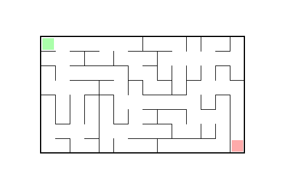

# MAZEGAME

A simple maze solving game. Most (or exclusively) enjoyable when played with a pen on tablets.

# Running the game

## Using Python

Requires Python >= 3.10.

1. Install requirements from `requirements.txt`.
2. Run with `python src/main.py`.

## Generating an EXE

Requires Python >= 3.10.

1. Install requirements from `requirements_with_pyinstaller.txt`.
2. Run `build_exe.bat`. This will (re-)generate `dist/MAZEGAME.exe`.

## Running the precompiled EXE

Download `dist/MAZEGAME.exe` and run it.
